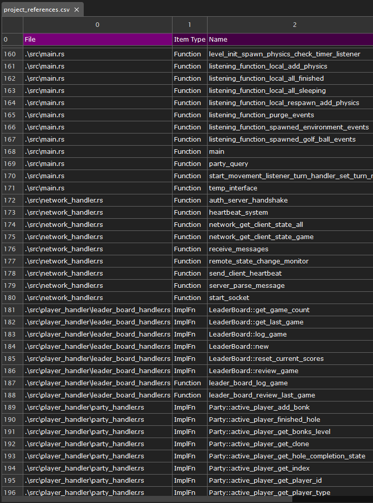

# all_calls_csv

Written initially as self developed tooling for developing games in Bevy.

Designed to parse local files and return an implementation spreadsheet for a highlevel overview of code in development. 

Tool will log the following:
- enum
- function
- impl::function
- struct
- trait



Project Implementation:
```cli 
    cargo install --git https://github.com/CodyTheDoer/rust_all_calls_csv
    cd ~/project_dir
    all_calls_csv
```

If you like you can explicitly call the '.exe' to 'all_calls_csv.exe' when calling the application but it is not required.

At this point a CSV will be generated in the following dirictory:
```
    ~/project_dir/spreadsheets/priject_implementation.csv
```